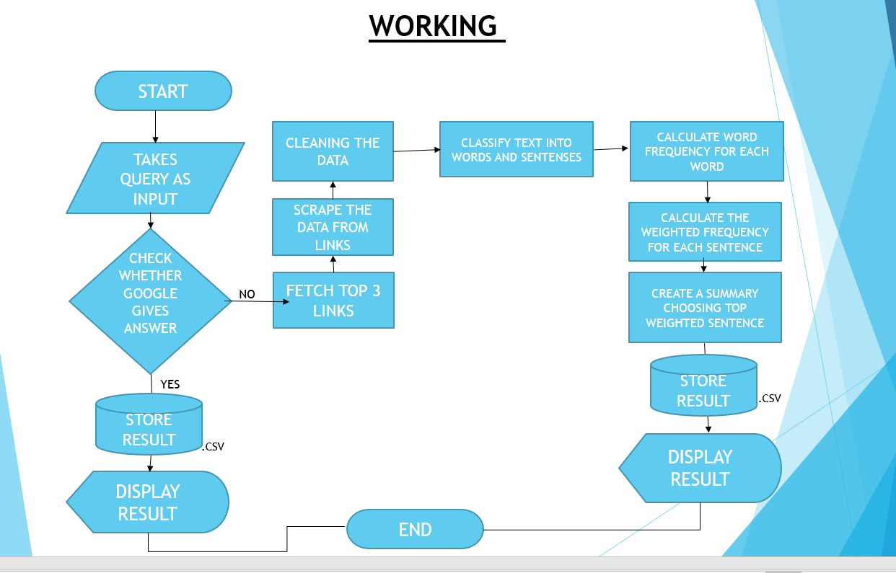

<br />
<p align="center">
  <a href="https://github.com/github_Abhayparashar/Google-Search-Query-Assistant">
    
  </a>

  <h3 align="center">Google Search Query Assistant</h3>

  <p align="center">
    Google Search Query Assistant makes google searches quite easy and query based. It basically increases the power of google to give answers to queries...
    <br />
    <a href="https://github.com/Abhayparashar31/Google-Search-Query-Assistant/"><strong>Explore the Project »</strong></a>
    <br />
    <br />
    <a href="#">View Web Demo</a>
    ·
    <a>Report Bug -> parasharabhay13@gmail.com</a>
    
  </p>
</p>


<!-- TABLE OF CONTENTS -->
## Table of Contents

* [About the Project](#about-the-project)
  * [Built With](#built-with)
* [Getting Started](#getting-started)
  * [Prerequisites](#prerequisites)
  * [Installation](#installation)
* [Contributers](#contributers)
* [License](#license)
* [Contact](#contact)


<!-- ABOUT THE PROJECT -->
## About The Project

 <a href="https://github.com/github_Abhayparashar/Google-Search-Query-Assistant">
    
  </a>


`Abhayparashar31`, `Google-Search-Query-Assistant`,  `parasharabhay13@gmail.com`


### Built With

* [Python](python)
* [NLP](Natural language processing)


<!-- GETTING STARTED -->
## Getting Started

Clone the repo and extract it ....

### Prerequisites

This is the list of things you need to use the software and how to install them.
* Python
```sh
Version python3.7<
```

### Installation
 
1. Clone the repo
```
git clone https://github.com/github_Abhayparashar31/Google-Search-Query-Assistant.git
```
2. Install Python Libraries
```
pip install requests
pip install BeautifulSoup
pip install nltk
pip install pyttsx3
pip install SpeechRecognition
pip install google

```

3. Required Imports:
```
import pyttsx3
from bs4 import BeautifulSoup 
import requests
from googlesearch import search
import speech_recognition as sr
import csv
import time
from tkinter import *
import re
from nltk.tokenize import sent_tokenize,word_tokenize
import heapq
from nltk.corpus import stopwords
  ```

4. Bat file:

  ```
@echo off
call YOUR_VENV_LOCATION\scripts\activate
cd INSTALLED_FOLDER
cls
pythonw engine.py
exit
```

5. Vbs script:
	Save the script with same location as the bat file. using the vbs script the gui will open without a console.
  Code:
```
Set oShell = CreateObject ("Wscript.Shell") 
Dim strArgs
strArgs = "cmd /c BATFILE_NAME.bat"
oShell.Run strArgs, 0, false
```
 <a href="https://github.com/github_Abhayparashar/Google-Search-Query-Assistant">
    
  </a>
## Contributers

Abhayparashar31


<!-- LICENSE -->
## License

Distributed under the MIT License. See `LICENSE` for more information.


<!-- CONTACT -->
## Contact

Your Name - Abhayparashar31

Project Link: [https://github.com/Abhayparashar31/Google-Search-Query-Assistant/](https://github.com/Abhayparashar31/Google-Search-Query-Assistant/)


## References
* Stackoverflow
* Data flair
* Towards data science
